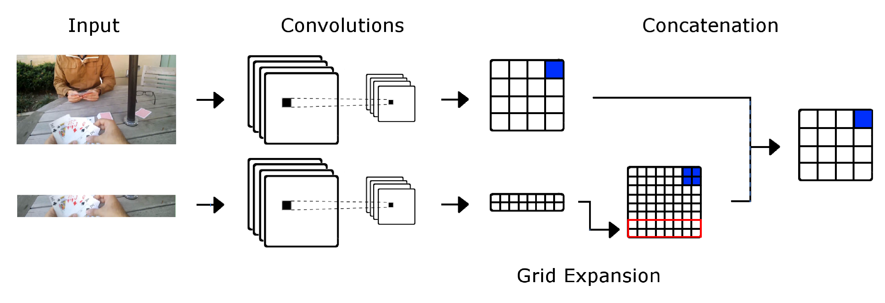

# YOLO-Zoom
YOLO program with an attention network looking at the bottom of the image. This code was used for our [paper](https://link.springer.com/chapter/10.1007/978-3-030-30645-8_11). This code is based on the [YOLOv2](https://github.com/pjreddie/darknet) code.

This code concatenates two Neural Network streams with the second stream being a zoomed Neural Network focusing on the bottom of the image. The second stream is then associated with only the bottom of the first stream.



To use the masking in a layer you can set Mask=1 like this:

```
[convolutional]
batch_normalize=1
filters=512
size=1
stride=1
pad=1
activation=leaky
mask=1
```
The annotations are the same as YOLO, to train you need a file "egoDailyDisamTrain.txt" with each line pointing to the images 

```
<Path-to-images>/frame-0001.jpg
<Path-to-images>/frame-0002.jpg
<Path-to-images>/frame-0003.jpg
...
```

And you need the annotations to be in the same path, however, if the path has the word "images" in any portion of it, it will be replaced to "labels", so the program will look for the annotations like 

```
<Path-to-labels>/frame-0001.txt
<Path-to-labels>/frame-0002.txt
<Path-to-labels>/frame-0003.txt
...
```

We include a simple matlab program to annotate the images based on the [EgoDaily](https://github.com/sercruzg/EgoDaily) dataset.
To start training you can use the following command

```
./darknet detector train_joint_bottom /public/scruzgome2/yolo/yolov2/darknet/egoDailyDisamObj.data yoloEgoDaily384Disam.cfg ./backup/yoloEgoDaily384Disam_final.weights -bottomW ./backup/yoloEgoDailyH96W384Own4Disam_final.weights -bottomNet yoloEgoDailyH96W384Own4Disam.cfg -gpus 0 -dont_show -clear -joinNet yoloEgoDailyJoinLateH96W384Own4Disam.cfg
```

### Citing YOLO-Zoom
If you find this code useful in your research, please consider citing:
```
@InProceedings{10.1007/978-3-030-30645-8_11,
author="Cruz, Sergio R.
and Chan, Antoni B.",
title="Hand Detection Using Zoomed Neural Networks",
booktitle="Image Analysis and Processing -- ICIAP 2019",
year="2019",
publisher="Springer International Publishing",
address="Cham",
pages="114--124",
isbn="978-3-030-30645-8"
}
```
